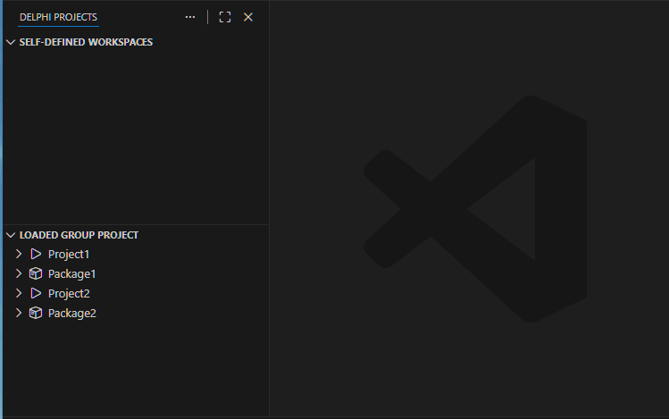
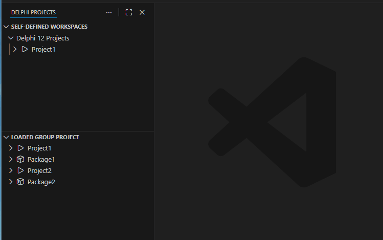
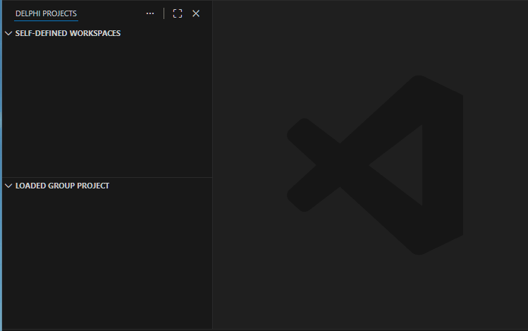
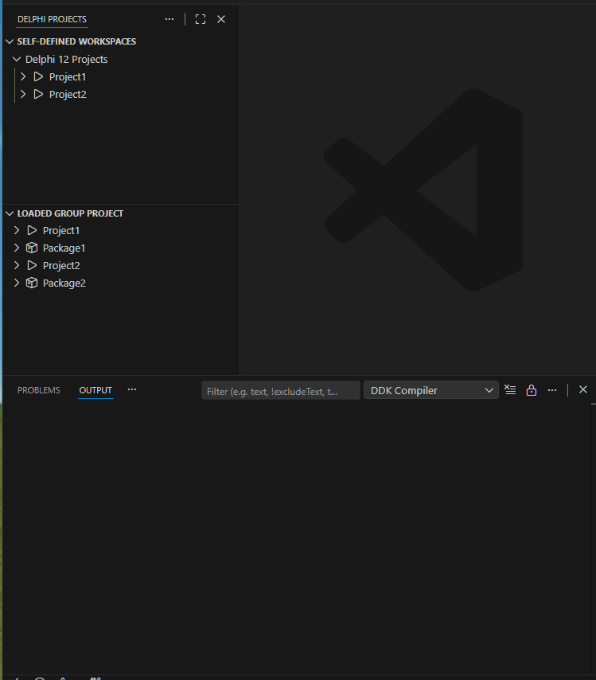
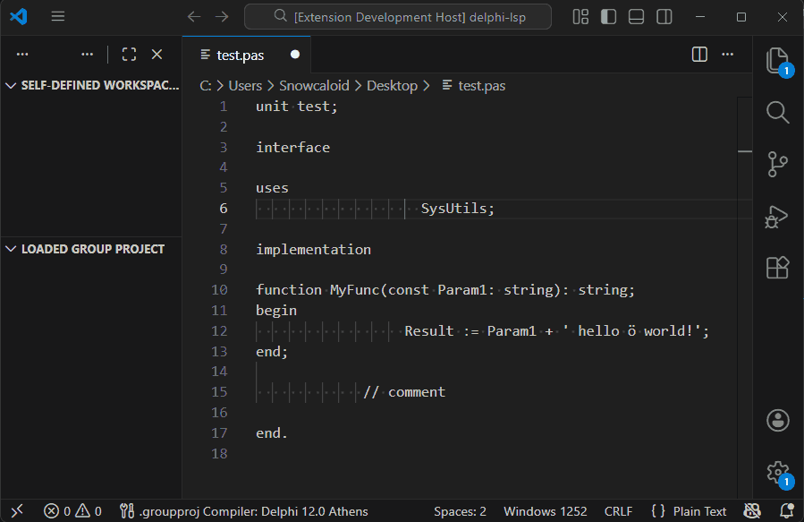

# Delphi DevKit README

Utilities for developing in Delphi using VS Code.

This project is not affiliated, associated, authorized, endorsed by, or in any way officially connected with Embarcadero Technologies, or any of its subsidiaries or its affiliates. The official Embarcadero Technologies website can be found at [https://www.embarcadero.com/](https://www.embarcadero.com/).

This extension does not include any proprietary Embarcadero code, libraries or binaries. To build Delphi projects, you must have a valid Delphi installation and the necessary environment variables set up.

This extension is currently developed in my free time, and any feedback is welcome.

## Features

* **Dual Project Views**: Two separate project management approaches:
  - **Self-Defined Workspaces**: User-customizable project workspaces with drag & drop support
  - **Loaded Group Project**: Load and manage Delphi group projects (.groupproj) - readonly view
* **Multi-Compiler Support**: Configure and switch between multiple Delphi versions (Delphi 2007 → Delphi 13.0 Florence built-in)
* **Project Management**: Compile, recreate, run, and manage Delphi projects with keyboard shortcuts
* **Bulk Compilation**: Compile or recreate all projects in a workspace or group project at once; cancellable at any time
* **Workspace Management**: Create, rename, remove workspaces and move projects between them
* **File System Integration**: Show projects in Explorer, open in File Explorer
* **Configuration Management**: Create and configure .ini files for executables
* **Visual Indicators**: File icons for Delphi files and missing file indicators
* **Configuration Import/Export**: Backup and restore your entire DDK configuration
* **File-Based Persistence**: Project and compiler data stored as RON files in `%APPDATA%/ddk/`
* **File Navigation**: .pas <-> .dfm swapping with Alt+F12 hotkey
* **Smart Navigation**: .dfm -> .pas jumps with Ctrl+click
* **Compiler Output Enhancements**: Timestamps, clickable file links, and diagnostics published to the Problems panel
* **Formatter Support**: Configurable Delphi code formatter via GExperts
* **LSP Server**: Bundled `ddk-server` (Rust) handles all project state, compilation, and formatting

## Demos

### Add a Workspace and drag in a Project

### Add a Project via dialog

### Load a Group Project

### Compile a Project

### Format Delphi Source

## Commands

### File Navigation
* `Swap .DFM/.PAS` - Switch between form and unit files (Alt+F12)

### Project Management
* `Select Delphi Compiler for Group Projects` - Choose the active compiler configuration for .groupproj files
* `Pick Group Project` - Load a Delphi group project (.groupproj)
* `Unload Group Project` - Unload the currently loaded group project
* `Refresh` - Refresh the projects view and discover file paths

### Workspace Management
* `Add Workspace` - Create a new self-defined workspace
* `Rename Workspace` - Rename an existing workspace
* `Remove Workspace` - Delete a workspace and its projects
* `Add Project` - Add projects to a workspace
* `Remove Project` - Remove projects from a workspace

### Configuration
* `Import Configuration` - Import DDK configuration from JSON file
* `Export Configuration` - Export DDK configuration to JSON file
* `Edit Default .ini` - Edit the default INI template file
* `Edit Formatter Config` - Edit the Delphi formatter configuration file
* `Reset Formatter Config` - Reset the formatter configuration to defaults
* `Edit Compiler Configurations` - Open the compiler configurations RON file directly
* `Edit Projects Data` - Open the projects data RON file directly

### Project Actions (Available via context menu and keyboard shortcuts)
* `Compile Selected Project` - Compile the selected project (Ctrl+F9)
* `Recreate Selected Project` - Clean and rebuild the selected project (Shift+F9)
* `Compile All in Workspace` - Compile all projects in a workspace
* `Recreate All in Workspace` - Clean and rebuild all projects in a workspace
* `Compile All in Group Project` - Compile all projects in the loaded group project
* `Recreate All in Group Project` - Clean and rebuild all projects in the loaded group project
* `Cancel Compilation` - Cancel the active compilation (Ctrl+F2)
* `Run Selected Project` - Execute the selected project (F9)
* `Configure/Create .ini` - Create or edit INI configuration files
* `Set Manual Path` - Manually set the .dproj path for a project

## Extension Settings

* `ddk.compiler.encoding`: Character encoding used to decode MSBuild output (`oem` by default, use `utf8` if your paths contain non-ASCII characters).

## Compiler Configurations

Compiler configurations are stored in `%APPDATA%\ddk\compilers.ron` and managed by the DDK server. The extension ships with built-in presets for all Delphi versions from **Delphi 2007** to **Delphi 13.0 Florence**.

You can view and edit them directly via the `Edit Compiler Configurations` command. Each entry includes:

* `product_name` / `compiler_version` / `package_version` — version identifiers
* `installation_path` — root path of your Delphi installation
* `build_arguments` — MSBuild arguments passed during compilation
* `condition` — optional expression to enable/disable the entry

The first entry whose `GExperts.Formatter.exe` is found in its installation path is used for formatting.

## Project Views

### Self-Defined Workspaces
- **Customizable**: Create and organize your own project workspaces
- **Drag & Drop**: Move projects within and between workspaces
- **Compiler Assignment**: Each workspace has a predefined compiler
- **Persistent**: Projects and workspaces are stored in `%APPDATA%\ddk\projects.ron`

### Loaded Group Project
- **Read-Only**: View projects from .groupproj files
- **Compiler Selection**: Use the compiler picker for group project compilation
- **Cross-Copy**: Drag projects from group projects to self-defined workspaces

## Visual Indicators

* **Selected Project**: Shows `←S` indicator for the currently selected project
* **Missing Files**: Shows `!` indicator for files that don't exist
* **File Type Icons**: Custom icons for .pas, .dfm, .dpr, .dpk, .dproj files

## Keyboard Shortcuts

* `Alt+F12` - Swap between .PAS and .DFM files
* `Ctrl+F9` - Compile selected project (when project is selected)
* `Shift+F9` - Recreate selected project (when project is selected)
* `F9` - Run selected project (when project has executable)
* `Ctrl+F2` - Cancel active compilation

## Known Issues

None so far.

## Release Notes

### 2.0.0

- **Breaking**: SQLite database removed; data now stored as RON files in `%APPDATA%/ddk/`. Previously stored workspaces and projects will need to be re-added.
- Bundled `ddk-server` Rust binary for all project state, compilation, and formatting logic
- Preset compiler configurations for all Delphi versions from 2007 to 13.0 Florence
- Bulk compile/recreate for entire workspaces and group projects
- Cancellable compilation (Ctrl+F2)
- Delphi code formatter via GExperts (configurable)
- Timestamps and clickable links in all compiler output lines
- Diagnostics published to the VS Code Problems panel
- Fixed: selected project not working when tree was collapsed
- Fixed: removing workspaces/projects not working
- Fixed: Discover File Paths not doing anything

### 1.1.0

- Fixed the issue where the compiler's diagnostic output was always mapped as information and added error code to diagnostics.
- Added support for hyperlinks in compiler output channel.

### 1.0.0

- Complete rewrite with dual project view system
- Added Self-Defined Workspaces with drag & drop support
- Added Loaded Group Project view for .groupproj files
- Configuration import/export functionality
- Enhanced visual indicators and file icons
- Improved compiler management and project actions
- Added keyboard shortcuts for common operations
